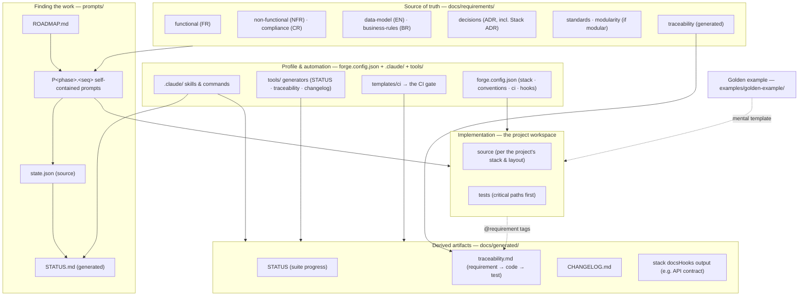

# Project map — where everything lives

> The mental map of a Forge-built project: **source of truth → prompts → code →
> derived artifacts**, and where each Forge piece sits. The starting point for an
> agent orienting itself before any change. The full workflow is in
> [`contributing-agents.md`](contributing-agents.md). Everything here is
> **stack-neutral** — the concrete code layout comes from the project's own stack
> and conventions in [`forge.config.json`](../../forge.config.json).

---

## 1. Diagram

---

## 2. Where each thing is

### Source of truth — `docs/requirements/`

Never invented. Seeded by genesis (`/forge-init`) at the chosen tier (`lean` /
`standard` / `full`). Index and ID taxonomy in `index.md`. Key documents (those
present depend on the tier):

| File                  | Holds                                             |
| --------------------- | ------------------------------------------------- |
| `vision.md`           | Problem, scope, users, glossary.                  |
| `functional.md`       | Functional requirements (`FR`).                   |
| `non-functional.md`   | Non-functional requirements (`NFR`) + critical paths. |
| `data-model.md`       | Entities (`EN`), attributes, relationships.       |
| `business-rules.md`   | Business rules (`BR`) + critical paths.           |
| `decisions.md`        | Architecture Decision Records (`ADR`), incl. the **Stack ADR**. |
| `compliance.md`       | Compliance requirements (`CR`) per regime (full tier). |
| `modularity.md`       | Shared core × modules, boundaries (full tier).    |
| `standards.md`        | Code & process standards (full tier).             |
| `traceability.md`     | **Generated** matrix (initial seed only).         |

To change a requirement: `/forge-add-requirement`.

### Finding the work — `prompts/`

- [`ROADMAP.md`](../../prompts/ROADMAP.md) — index of all phases/prompts.
- [`state.json`](../../prompts/state.json) — machine-readable state (**source**).
- [`STATUS.md`](../../prompts/STATUS.md) — human view (**generated**).
- `next_prompt.py` / `/forge-status` — next eligible prompt (topological over
  `dependsOn`).
- [`README.md`](../../prompts/README.md) §5 — the Definition of Done.
- The prompt template is `templates/prompt.template.md`.

### Implementation — the project workspace

The code layout follows the project's **own stack and conventions** (recorded in
`forge.config.json`), not a layout imposed by Forge. The golden example shows the
end-to-end *shape* (requirement → code → test → trace) in stack-light pseudocode;
a real project realizes that shape in its chosen language and structure. Each
major area carries its own `AGENTS.md` (layered guidance, Principle 8) — read the
one for the area you are touching.

### Profile & automation — `forge.config.json`, `.claude/`, `tools/`

- **The stack profile** ([`forge.config.json`](../../forge.config.json)): stack,
  conventions, critical paths, compliance regimes, traceability globs/aliases,
  `docsHooks`, and `ci` provider/commands. Read by every skill and tool.
- **Skills/commands** (`.claude/skills`, `.claude/commands`): see
  [`skills-catalog.md`](skills-catalog.md).
- **Generators** ([`tools/`](../../tools/README.md)): STATUS, traceability and
  changelog — orchestrated by `/forge-sync-docs`.
- **CI gate** ([`templates/ci/`](../../templates/ci/README.md)): commits,
  quality, and docs-freshness — commands sourced from `forge.config.json`.

### Derived artifacts — `docs/generated/` (never edited by hand)

`traceability.md` (requirement → code → test), `CHANGELOG.md`, and any stack
`docsHooks` output (e.g. an API contract or generated client). Regenerated by
`/forge-sync-docs`; CI fails if stale (Principle 6). The directory is
`forge.config.json → docs.generatedDir` (default `docs/generated`).

---

## 3. Orienting documents (in the repo)

| Document                                                      | For                                                    |
| ------------------------------------------------------------ | ------------------------------------------------------ |
| [`FORGE.md`](../../FORGE.md)                                  | The eight non-negotiable principles.                   |
| [`AGENTS.md`](../../AGENTS.md)                                | Root layered agent guide.                              |
| [`examples/golden-example/`](../../examples/golden-example/) | End-to-end reference feature (the mental template).    |
| [`contributing-agents.md`](contributing-agents.md)           | The full contribution workflow + Definition of Done.   |
| [`skills-catalog.md`](skills-catalog.md)                      | Catalog of skills/commands and recommended flows.      |
| [`forge.config.schema.md`](../../forge.config.schema.md)     | Field-by-field reference for the stack profile.        |
